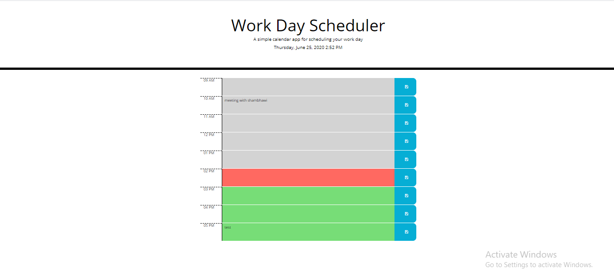

# Day-Planner

User can add and manage important events on a daily planner

- The application keeps track of daily level events.
- You can edit fields corresponding to time which helps as remainder of work/meetings that are scheduled
- You can edit and save hourly task. Data is saved in localStorage.
- If you launch the application, previously saved task will reflect.




## Prerequisites

```
git clone https://github.com/shambhawi13/Day-Planner.git
```

## Technologies Used
- JQuery - used for DOM manupulation
- Moment.js - used for utility on date objects
- HTML - used to create elements on the DOM
- CSS - styles html elements on page
- Git - version control system to track changes to source code
- GitHub - hosts repository that can be deployed to GitHub Pages

## Installing

- Clone the repository : git clone https://github.com/shambhawi13/Day-Planner.git


## Deployed Link

[Live Hosted on](https://shambhawi13.github.io/Day-Planner/)

## Authors

* **Shambhawi Kumari**
 [GitHub](https://github.com/shambhawi13/) | 
 [LinkedIn](https://www.linkedin.com/in/shambhawi-kumari/)


## Review URL

[GitHub](https://github.com/shambhawi13/Day-Planner)
[Live](https://shambhawi13.github.io/Day-Planner/)


